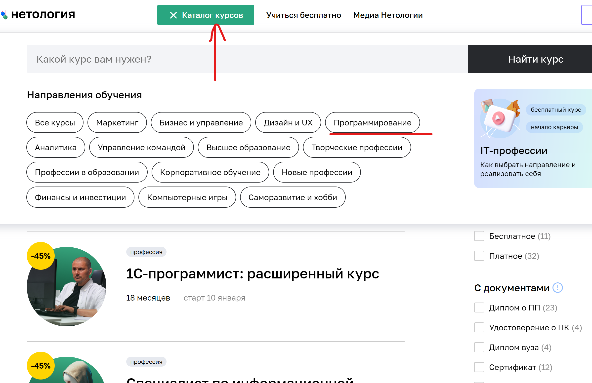

# План тестирования возможности записаться на обучение профессии «Тестировщик ПО»

## Перечень автоматизируемых сценариев:
#### Сценарий перехода на страницу профессии "Тестировщик ПО" 
1. Переход на страницу профессии "Тестировщик ПО":

   Шаги воспроизведения:

1. На главной странице Нетологии найти меню "Каталог курсов" и нажать на него.
2. В выпадающем меню в поле поиска ввести "Тестировщик ПО". 
3. Выбрать из списка профессий "Тестировщик ПО".

##### Ожидаемый результат: Пользователь попадает на страницу профессии "Тестировщик ПО".

2.Переход на страницу профессии "Тестировщик ПО" с помощью меню "Каталог курсов" и подменю "Программирование":

Шаги воспроизведения:

1. На главной странице Нетологии нажать на меню "Каталог курсов".
2. Выбрать из списка подменю "Программирование".
3. Выбрать из списка профессий "Тестировщик ПО".
#### Ожидаемый результат: Пользователь попадает на страницу профессии "Тестировщик ПО".

3.Переход на страницу профессии "Тестировщик ПО" с помощью выбора раздела "Программирование" на главной странице:

Шаги воспроизведения:

1. На главной странице Нетологии в блоке "Направления обучения" выбрать из списка подменю "Программирование".
2. Выбрать из списка профессий "Тестировщик ПО".
#### Ожидаемый результат: Пользователь попадает на страницу профессии "Тестировщик ПО".

#### Сценарий перехода к форме записи на курс
1.Переход к форме записи на курс с помощью кнопки "Записаться"

Шаги воспроизведения:

1. На странице профессии "Тестировщик ПО" в левой нижней части экрана нажать на кнопку "Записаться".

##### Ожидаемый результат: Пользователь переходит к форме записи на курс.

2.Переход к форме записи на курс с помощью кнопки "Записаться", которая появляется в правом верхнем углу страницы после скроллинга:
   
Шаги воспроизведения:

1. На странице профессии "Тестировщик ПО" прокрутить страницу вниз до появления окна "Запишитесь на курс".
2. Нажать на кнопку "Записаться" в правом верхнем углу страницы.

##### Ожидаемый результат: Пользователь переходит к форме записи на курс.

#### Сценарии заполнения формы записи на курс

Шаги воспроизведения:

1. Внесите валидные данные в каждоу поле (имя, телефон, почта)

#### Ожидаемый результат: Пользователь успешно записался на курс. Появилось сообщение: "Вы успешно записали на курс. Скоро наш менеджер свяжется с вами"

2. Внесите невалидные данные в каждое поле (имя, телефон, почта)
2.1. Внесение невалидных данных в поле "имя". 

Шаги воспроизведения:
1. Открыть форму записи.
2. Заполнить поля "Имя" невалидными данными.
3. Заполнить поле "Телефон", "Почта"
 валидными данными.

#### Ожидаемый результат: Пользовать не может записаться на курс. Появляется сообщение под полем "Имя": "Должно состоять из букв".

2.2. Внесение невалидных данных в поле "Телефон"

Шаги воспроизведения:
1. Открыть форму записи.
2. Заполнить поле "Имя", "Почта" валидными данными.
3. Заполнить поля "Телефон" невалидными данными.

#### Ожидаемый результат: Пользовать не может записаться на курс. Появляется сообщение под полем "Телефон": "Номер в формате +9(999)999-99-99".

2.3. Внесение невалидных данных в поле "Почта"

Шаги воспроизведения:
1. Открыть форму записи.
2. Заполнить поле "Имя", "Телефон" валидными данными.
3. Заполнить поля "Почта" невалидными данными.

#### Ожидаемый результат: Пользовать не может записаться на курс. Появляется сообщение под полем "Почта": "Неверный email".

## 2.Перечень используемых инструментов
1. Язык программирования Java, платформы для написания автотестов и их запуска.
2. Ситсемы управления проектами Maven/Gradle помогут правильно их организовать.
3. Среда разработки IntelliJ IDEA.
4. Система управления версиями Git позволит отслеживать изменения файлов, хранить их версию, оперативно возвращаться в любое сохраненное состояние.
5. Сервис для совместной разработки GitHub поможет работать над проектом сразу нескольким людям из любого места.
6.  Docker позволяет подключать сразу необходимые данные, базы, контейнеры.

## 3. Перечень необходимых разрешений, данных и доступов
1. Разрешение на выполнение автоматизированного тестирования сайта от владельца сайта.
2. Доступ к базе данных и к API сайта.
2. Доступ к документации (требованиям, спефицикациям).
3. ПОдготовка тестовых данных.
4. Репортинг.

## 4. Перечень и описание возможных рисков при автоматизации
1. Отсутствие необходимых разрешений и доступов.
2. Отсутствие необходимых текстовых меток для поиска локаторов, что увеличивает время на разработку тестов.
3. Изменение структуры сайта в ходе выполнения проекта приводит к уточнению локаторов.
4. Технический сбой.
5. Дополнительные затраты - на разработку тестов, поддержку, запуск и т.д.
6. Сложность сравнения результатов - ожидаемый/фактический.
7. Повышение требований к уровню тестировщика.
8. Неподдержание тестов, кодов, их неактуальность.

## 5. Перечень необходимых специалистов для автоматизации
Инженер по автомат. тестированию

## 6. Интервальная оценка с учетом риска в часах
  На начальном этапе необходим 1 автотестировщик. 
  Такой специалист может справиться с поставленным объемом работы, например за 3-4 рабочих дня.
  Далее, нужно поддерживать тесты, адаптировать код под изменения.
